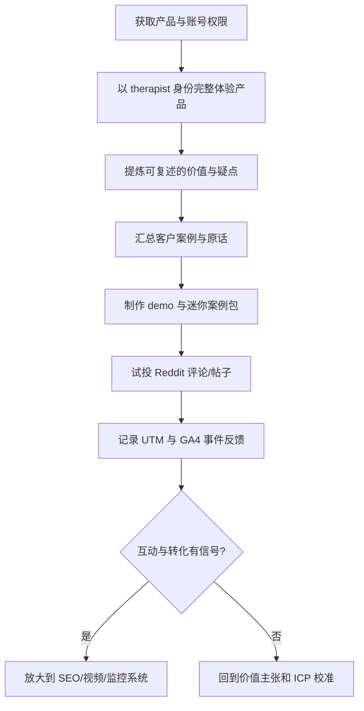

# feat: 调整 Auxora GTM 第一步优先级

## Overview

现有 onboarding 和 [`docs/plans/2026-03-23-feat-auxora-gtm-execution-plan.md`](docs/plans/2026-03-23-feat-auxora-gtm-execution-plan.md) 的方向总体没错，但第一步排序不够稳。当前 Week 1 把 Reddit 评论放在最前，这能快速产出，却会让分发先于验证。对 Auxora 这种早期产品，更合理的第一步应该是先建立一手认知、真实 proof 和最小追踪闭环，再去放大分发。

## Problem Statement / Motivation

当前顺序的主要问题：

- Calder 还没形成足够强的一手产品体验，就要在 Reddit 上以“高级营销顾问”口吻输出，容易变成泛建议。
- SEO、视频、Reddit 都需要可重复引用的 proof；如果没有 dogfooding 结果或客户语言，内容会空。
- Week 3 才上 GA4，意味着前两周的大部分触达没有统一基线，后续很难判断哪个渠道真的有效。
- onboarding PDF 里虽然强调“Day 1 就贡献价值”，但没有把“先验证再放大”写成门控机制。

## Research Summary

### Internal Findings

- [`calder_onboarding.pdf`](calder_onboarding.pdf) 将 Week 1 定义为 Reddit、关键词研究、Demo 视频三件事；价值是快，但假设了产品、消息和分发口径已经足够清晰。
- [`info.md`](info.md) 明确指出 Auxora 最大短板是曝光低，同时最强机会是 dogfooding 和真实案例。
- 仓库内没有 `docs/solutions/`，也没有更多 institutional learnings 可复用。

### External Findings

- Google Search Central 的 people-first content 指南强调内容要服务“现有或预期受众”，并体现“first-hand expertise”；为了搜索流量批量产内容是反模式。  
  来源：<https://developers.google.com/search/docs/fundamentals/creating-helpful-content>
- Google 2024 core update / spam policies 明确打击 scaled content abuse，说明不该把“先批量做 SEO 内容”当 Week 1 主动作。  
  来源：<https://developers.google.com/search/blog/2024/03/core-update-spam-policies>
- Reddit 的 `Reddiquette` 和 `Impersonation` 规则都要求真实、准确、不误导；如果使用品牌或共享账号，必须明确授权和身份边界。  
  来源：<https://support.reddithelp.com/hc/en-us/articles/205926439-Reddiquette>  
  来源：<https://support.reddithelp.com/hc/en-us/articles/360043075032-Impersonation>
- GA4 官方推荐事件直接覆盖 `sign_up`、`generate_lead`、`purchase`，并建议用 Realtime / DebugView 验证，因此埋点不该拖到 Week 3 才开始。  
  来源：<https://developers.google.com/analytics/devguides/collection/ga4/events>  
  来源：<https://developers.google.com/analytics/devguides/collection/protocol/ga4/reference/events>
- Reddit 官方的 promoted post 流程说明，付费放大更适合建立在已有帖子和基础广告账户之上，而不是作为早期不确定信息下的首动作。  
  来源：<https://support.reddithelp.com/hc/en-us/articles/16750646696212-Promote-your-post>

## Proposed Solution

将“第一步”改成一个 5 天门控式冲刺，不按 onboarding 原顺序硬执行：

1. **先做产品与信号校准**
   Day 1 获取产品权限，以 therapist 身份完整跑一次 GTM Report 流程，记录 10 个“真有说服力 / 真不可信 / 真难解释”的观察。
2. **先拿到可引用的证据**
   Day 1-2 与 Hui 对齐现有 7 个付费客户里最值得讲的 2 个案例，抽出真实前后变化、原话和禁止公开的信息边界。
3. **先做最小 proof asset**
   Day 2-3 产出一个“Auxora for Auxora” 迷你案例包：1 个 60 秒 demo、1 张前后对比图、1 段 150 字价值陈述。
4. **再开始 Reddit 与内容试投放**
   Day 3-5 用 proof asset 支撑评论和帖子，不急着追数量，只跑 3 条高质量评论 + 1 条个人/品牌视角帖，观察互动质量。
5. **把 GA4 前移成基线工作**
   Week 1 内先确认事件方案和 UTM 规范，哪怕完整 dashboard 还没做完，也要让之后的分发可归因。

## Technical Considerations

- **社区风险**：使用 `u/BeatImpress____` 前必须确认该账号的授权归属、简介、是否需要显式说明与 Auxora 的关系。
- **内容风险**：所有 SEO / Reddit / 视频文案都必须来自真实产品体验或客户原话，避免“趋势词驱动”的空内容。
- **数据风险**：若 `sign_up`、`generate_lead`、`purchase` 事件未定义，Week 1 的所有分发反馈都只能停留在主观判断。

## System-Wide Impact

- **Interaction graph**：产品体验记录会直接影响 demo 脚本、Reddit 口径、SEO 角度和后续视频 pipeline 输入。
- **Error propagation**：如果产品权限、客户案例权限或账号权限任一缺失，整个 Week 1 的外部动作都应降级为内部素材准备。
- **State lifecycle risks**：若先发内容再补埋点，会造成早期来源与转化无法还原。
- **API surface parity**：公开对外的说法需要在官网、Reddit、视频脚本里保持同一价值主张。
- **Integration test scenarios**：
  - 无产品权限时，Week 1 如何改成客户访谈与素材整理模式。
  - Reddit 账号不可用时，是否改用个人账号或仅做监听。
  - GTM Report MVP 未按时上线时，视频与 CTA 如何调整。

## SpecFlow Analysis

关键缺口与澄清点：

- 当前主 ICP 是 therapist 优先，还是三条 vertical 并行。
- 现有 7 个客户里哪些可公开，哪些只能内部引用。
- Reddit 动作是以个人身份、品牌身份，还是混合。
- Week 1 是否能拿到最小 GA4 / UTM 支持；如果不能，谁负责补齐。

## Implementation Phases

### Phase 1: 校准与证据收集（Day 1-2）

- 获取产品权限、Reddit 账号权限、可公开案例边界。
- 完成 1 次 therapist dogfood 流程。
- 输出 `docs/plans/mock-week1-proof-notes.md` 风格的内部笔记一份。

### Phase 2: 最小资产生产（Day 2-3）

- 产出 60 秒 demo。
- 产出 1 张“问题 - 方案 - 结果”静态图。
- 产出 1 段可复用价值陈述，供 Reddit / SEO / landing page 共用。

### Phase 3: 小规模分发验证（Day 3-5）

- 发 3 条高质量评论，不追 5 条 KPI。
- 发 1 条有明确案例支撑的帖子或 profile post。
- 建立基础 UTM 命名和 GA4 事件映射。

## Alternative Approaches Considered

### 方案 A：完全按 onboarding 执行

优点：快，交付物明确。  
缺点：容易先做动作、后补判断，Week 1 产出可能难以复用。

### 方案 B：完全先做 SEO 研究，再做社区分发

优点：看起来更系统。  
缺点：会延迟外部反馈，而且 SEO 研究若脱离真实案例，容易空转。

### 选择理由

采用“proof-first，再 distribution”的折中方案。它保留 onboarding 的速度感，但把最脆弱的部分从“直接分发”改成“先验证信息密度”。

## Acceptance Criteria

### Functional Requirements

- [ ] Week 1 的第一优先级从“Reddit 数量”改为“产品体验 + 证据资产 + 最小分发验证”
- [ ] 形成 1 个可公开复用的 mini proof asset
- [ ] 形成 1 份明确的 Week 1 日程表，替代原始 onboarding 顺序
- [ ] 定义最小 GA4 / UTM 事件方案：`sign_up`、`generate_lead`、`purchase`

### Non-Functional Requirements

- [ ] 对外说法必须基于真实体验或真实客户素材
- [ ] Reddit 行为不得触发身份误导或低质自我推广风险
- [ ] 每个公开动作都可以被后续复盘归因

### Quality Gates

- [ ] Hui 确认 Week 1 调整后的优先级
- [ ] Calder 完成至少 1 次完整产品 walkthrough
- [ ] 团队确认可公开使用的案例素材边界

## Success Metrics

- Day 3 前完成 1 套可复用 proof asset
- Week 1 结束前拿到至少 1 个高质量外部互动信号：实质回复、DM、demo 请求或站内点击
- Week 1 结束前，后续渠道都能复用同一套价值主张，而不是各写各的

## Dependencies & Risks

- **产品权限**：没有权限，计划只能退化成资料整理。
- **案例授权**：没有真实案例边界，不能安全对外讲结果。
- **GA4 / UTM 支持**：没有基础归因，Week 1 只能看表面互动。
- **Reddit 账号状态**：若账号低 karma 或身份模糊，先做监听与少量评论，不做品牌强曝光。

## Recommended Week 1 Schedule

- **Mar 24**：产品权限、客户案例边界、Reddit 账号权限、1 次完整 dogfood
- **Mar 25**：提炼价值主张、写 demo 脚本、确定最小 GA4 / UTM 方案
- **Mar 26**：完成 demo 与静态 proof asset
- **Mar 27**：发布 2 条高质量 Reddit 评论，记录反馈
- **Mar 28**：发布第 3 条评论或 1 条帖子，复盘 Week 1 信号，决定 Week 2 是加码 Reddit、补 SEO，还是先继续校准

## Sources & References

### Internal References

- [`docs/plans/2026-03-23-feat-auxora-gtm-execution-plan.md`](docs/plans/2026-03-23-feat-auxora-gtm-execution-plan.md)
- [`info.md`](info.md)
- [`calder_onboarding.pdf`](calder_onboarding.pdf)

### External References

- Google Search Central: Creating helpful, reliable, people-first content  
  <https://developers.google.com/search/docs/fundamentals/creating-helpful-content>
- Google Search Central Blog: March 2024 core update and spam policies  
  <https://developers.google.com/search/blog/2024/03/core-update-spam-policies>
- Reddit Help: Reddiquette  
  <https://support.reddithelp.com/hc/en-us/articles/205926439-Reddiquette>
- Reddit Help: Impersonation  
  <https://support.reddithelp.com/hc/en-us/articles/360043075032-Impersonation>
- Google Analytics for Developers: Set up events  
  <https://developers.google.com/analytics/devguides/collection/ga4/events>
- Google Analytics event reference  
  <https://developers.google.com/analytics/devguides/collection/protocol/ga4/reference/events>
- Reddit Help: Promote your post  
  <https://support.reddithelp.com/hc/en-us/articles/16750646696212-Promote-your-post>
